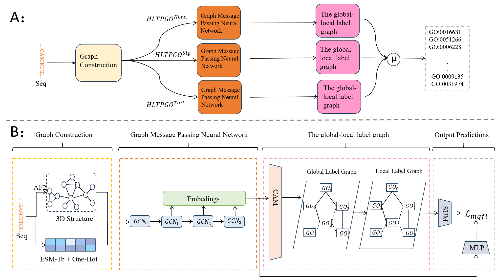

# GOBoost: Leveraging Long-Tail Gene Ontology Terms for Accurate Protein Function Prediction

<div align="center">
  
</div>
we propose the GOBoost method, which incorporates a long-tail optimization ensemble strategy. GOBoost employs the base model GOBoost Sig, introduces a global-local label graph module, and utilizes a multi-granularity focal loss function to enhance long-tail functional information, mitigate the long-tail phenomenon, and improve overall prediction accuracy.

## Installation

```bash
# clone the repo
git clone https://github.com/Cao-Labs/GOBoost.git
cd GOBoost
```
We use python 3.9.19 and pytorch 1.13.0. We recommend using conda to install the dependencies:
```bash
conda env create -f environment.yml
```
You also need to install the relative packages to run ESM-1b protein language model. \
Please see [facebookresearch/esm](https://github.com/facebookresearch/esm#getting-started-with-this-repo-) for details. 

## Usage

### Trained model

Our trained model can be downloaded from [here](https://zenodo.org/records/14048928).

The model with the "_pdb" suffix is ​​trained on the PDB dataset for all function labels. The rest of the models are trained on the PDB and AF2 datasets. The model with the "_All" suffix is ​​trained on all function labels, the model with the "_Head" suffix is ​​trained on the high-frequency labels at the head, and the model with the "_Tail" suffix is ​​trained on the medium- and low-frequency labels at the tail.

### Model Training:
```bash
python train.py --train_part ${base_model_nane} --batch_size ${batch_size} --epochs ${max_epoch} --sub_function ${sub-functional ontologies} --AF2model ${enhanced} --config-file ${config}
# python train.py --train_part All --batch_size 32 --epochs 100 --sub_function cc --AF2model True --config-file ./configs/best/cfg_protein_cc.py
```
train.py is used to train the basic model. where `--train_part` is the type of the base model for training， including {All, Head, Tail}; `--batch_size` is the size of each batch; `--epochs` is the maximum number of iterations for training, `--sub_function` are the specific functional categories trained, including {mf, bp, cc}, `--AF2model` is whether to use the AF2 dataset to enhance the training data(The default value is False); `--config-file` is the path to the model configuration file. 

### Model Test:
```bash
python test.py --train_part ${base_model_nane} --batch_size ${batch_size} --dataset  ${test-dataset} --sub_function ${sub-functional ontologies} --AF2model ${enhanced} --config-file ${config}
# python test.py --train_part All --batch_size 32 --dataset AF2test --sub_function cc --AF2model True --config-file ./configs/best/cfg_protein_cc.py
```
test.py is used to test the prediction performance of the base model. where `--train_part` is the type of the base model， including {All, Head, Tail}; `--batch_size` is the size of each batch; `--dataset` is the test data set, where AF2test is the AF2 test set and test is the PDB test set; `--sub_function` are the specific functional categories tested, including {mf, bp, cc}; `--AF2model` is True, indicating that the test set is the AF2 test set(The default value is False, indicating the PDB test set); `--config-file` is the path to the model configuration file. 

### Ensemble:
```bash
python Ensemble.py --ontology ${sub-functional ontologies}
# python ./Ensemble.py --ontology cc
```
Ensemble.py is used to integrate the training results of the basic model. where `--ontology` are the specific functional categories tested, including {mf, bp, cc}. 

### Protein Function Prediction:
```bash
python Predictor.py  --sub_function ${sub-functional ontologies} --config-file $ {config} --pdb ${pdb-fila} --prob $ {threshold}
# python Predictor.py  --sub_function cc --config-file ./configs/best/cfg_protein_cc.py --pdb ./data/4RQ2-A.pdb --prob 0.5
```
Predictor.py is used to predict protein function. where `--sub_function` is the type of function to be predicted, including {mf, bp, cc}; `--config-file` is the path to the model configuration file; `--pdb` is the path to the protein PDB file; `--prob` is the threshold for feature prediction.

#### output
```txt
The protein may hold the following functions of CC:
Possibility: 0.55 ||| Functions: GO:0031974, membrane-enclosed lumen
Possibility: 0.56 ||| Functions: GO:0031981, nuclear lumen
Possibility: 0.54 ||| Functions: GO:0070013, intracellular organelle lumen
Possibility: 0.53 ||| Functions: GO:1902494, catalytic complex
Possibility: 0.59 ||| Functions: GO:0005654, nucleoplasm
Possibility: 0.61 ||| Functions: GO:0005739, mitochondrion
Possibility: 0.59 ||| Functions: GO:0005829, cytosol
Possibility: 0.56 ||| Functions: GO:0000781, chromosome, telomeric region
Possibility: 0.98 ||| Functions: GO:0005634, nucleus
Possibility: 0.55 ||| Functions: GO:0043233, organelle lumen
```
